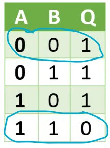
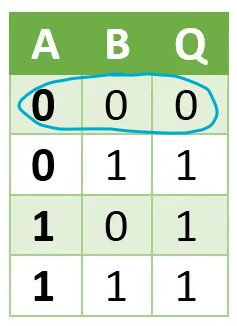
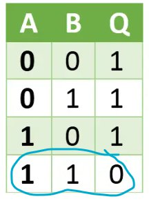
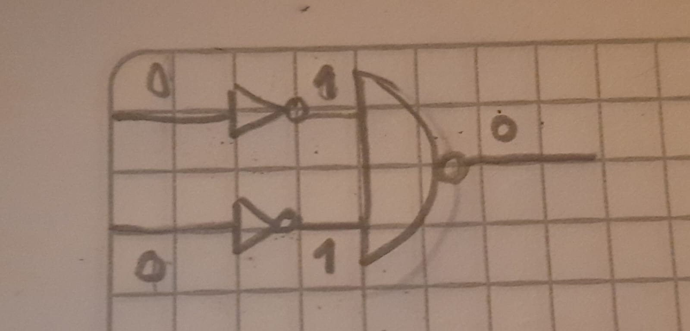
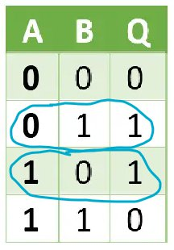
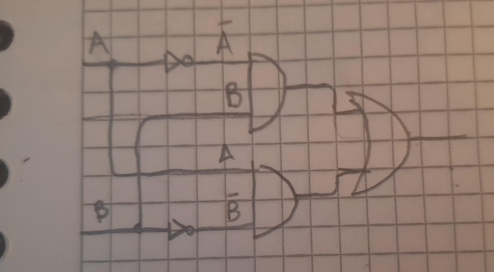
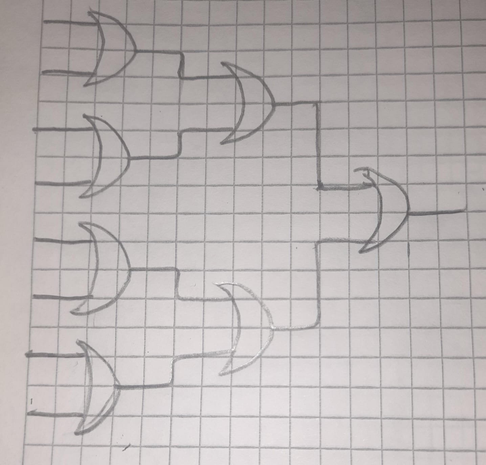

Para realizar la práctica de Lógica B leana se partió de la puerta NAND
el cual el pr yect ya n s daba.

NOT

Para realizar la puerta NOT se tuv en cuenta la tabla de verdad de NAND:

En d nde se tuv en cuenta d s cas s:

> ● Las entradas s n 0 0 y su salida es 1. ● Las entradas s n 1 1 y su
> salida es 0.

Ya que las entradas s n iguales y la salida es c ntraria. Ent nces si
las entradas s n la misma, su salida será c ntraria, cumpliend c n la
lab r de la puerta NOT.

P r l tant , se utilizó una NAND d nde sus d s entradas s n la misma (la
entrada única que tendría la NOT).

CHIP N t {

> IN in; OUT ut;
>
> PARTS:

Nand(a=in, b=in, ut= ut); }

AND:

Para realizar la puerta AND, l únic que se hiz fue utilizar una puerta
NAND y

p steri rmente se pasó la salida p r una NOT. De esta f rma la salida de
NAND se invierte, cumpliend la función del AND.

CHIP And {

> IN a, b; OUT ut;

> PARTS:
>
> Nand(a=a, b=b, ut=nandOut); N t(in=nandOut, ut= ut);

}

OR:

Si
ret mam s la tabla de verdad de NAND, p dem s bservar que el únic cas en
el que la salida es 0, es cuand ambas entradas s n 1:

Ah ra si bservam s la tabla de verdad de OR, p dem s bservar que el únic

cas en el que la salida es 0, es cuand ambas entradas s n 0:

Ent nces, si invertim s las d s entradas del NAND, se btendría la
función del OR:

C n est , cuand ambas entradas s n 0, la salida será 0. Cualquier tra
pción dará c m salida 1.

CHIP Or {

> IN a, b; OUT ut;
>
> PARTS:
>
> N t(in=a, ut=n tA); N t(in=b, ut=n tB);

Nand(a=n tA, b=n tB, ut= ut); }

XOR:

La
tabla de verdad de XOR es:

Para realizar la puerta XOR,
se evaluó l que pasaba al c mbinar una AND c n una NOT en una de sus
entradas, bservand que las tablas de verdad s n:

Si c mparam s la tabla de verdad de la puerta XOR c n estas tablas de
verdad, se puede bservar que si c mbinam s dich s circuit s (juntarl s c
n una OR),

btendrem s la tabla de verdad de XOR:

CHIP X r { IN a, b; OUT ut;

> PARTS:
>
> N t(in=a, ut=n tA); N t(in=b, ut=n tB);
>
> And(a=n tA, b=b, ut=and1); And(a=a, b=n tB, ut=and2); Or(a=and1,
> b=and2, ut= ut);

}

MUX:

Para btener el multiplex r (MUX) hay que tener en cuenta la dependencia
del resultad hacia el select r (sel). Si el select r es 0, el resultad
será (a), y si el select r es 1, el resultad será (b). Ent nces, se
utilizó una puerta NOT para negar el select r.

P steri rmente se utilizar n d s puertas AND, una para (a) y tra para
(b). En el cas de la AND de (a), su segunda entrada fue el select r
negad . Mientras que en la AND de (b), su segunda entrada fue el select
r. Est se hiz c n el pr pósit de que si el select r es 0, anulará a (b)
per dejará pasar a (a). Y si el select r es 1,

currirá l c ntrari , anulará a (a) per dejará pasar a (b).

Finalmente, se utilizó una puerta OR para c mbinar las salidas de las
AND, est

para que la salida sea (a) (b), según el val r del select r. CHIP Mux {

> IN a, b, sel; OUT ut;
>
> PARTS:
>
> N t(in=sel, ut=n tSel); And(a=a, b=n tSel, ut=andA); And(a=b, b=sel,
> ut=andB); Or(a=andA, b=andB, ut= ut);

}

DMux:

El demultiplex r (DMux), c nsiste en que si el select r es 0, la salida
(a) será la entrada (in) y la salida (b) será 0. Si el select r es 1, la
salida (b) será la entrada (in) y la salida (a) será 0. P r l que de f
rma similar al multiplex r, se utilizó una puerta NOT para negar el
select r.

P steri rmente se utilizar n d s puertas AND, una para la salida (a) y
tra para la salida (b). Las entradas de la AND de (a) s n la entrada
riginal (in) y el select r negad , de esta f rma, en cas del select r
ser 0, el select r negad será 1 y (a) será el val r de entrada (in). Las
entradas de la AND de (b) s n la entrada riginal de (in) y el select r,
de esta f rma, en cas del select r ser 1, (b) será el val r de entrada
(in).

CHIP DMux {

> IN in, sel; OUT a, b;
>
> PARTS:
>
> N t(in=sel, ut=n tSel); And(a=in, b=n tSel, ut=a); And(a=in, b=sel,
> ut=b);

}

N t16:

La puerta N t16 t ma una entrada de 16 bits y l s niega t d s. Para
realizarla se utilizó una puerta NOT para cada un de l s 16 bits para
negarl s.

CHIP N t16 {

> IN in\[16\]; OUT ut\[16\];
>
> PARTS:
>
> N t(in=in\[0\], ut= ut\[0\]); N t(in=in\[1\], ut= ut\[1\]); N
> t(in=in\[2\], ut= ut\[2\]); N t(in=in\[3\], ut= ut\[3\]); N
> t(in=in\[4\], ut= ut\[4\]); N t(in=in\[5\], ut= ut\[5\]); N
> t(in=in\[6\], ut= ut\[6\]); N t(in=in\[7\], ut= ut\[7\]); N
> t(in=in\[8\], ut= ut\[8\]); N t(in=in\[9\], ut= ut\[9\]);
>
> N t(in=in\[10\], ut= ut\[10\]); N t(in=in\[11\], ut= ut\[11\]); N
> t(in=in\[12\], ut= ut\[12\]); N t(in=in\[13\], ut= ut\[13\]);
>
> N t(in=in\[14\], ut= ut\[14\]); N t(in=in\[15\], ut= ut\[15\]);

}

And16:

Se utilizó una puerta AND para cada un de l s 16 bits de ambas entradas
para generar la salida de 16 bits.

CHIP And16 {

> IN a\[16\], b\[16\]; OUT ut\[16\];
>
> PARTS:
>
> And(a=a\[0\], b=b\[0\], ut= ut\[0\]); And(a=a\[1\], b=b\[1\], ut=
> ut\[1\]); And(a=a\[2\], b=b\[2\], ut= ut\[2\]); And(a=a\[3\],
> b=b\[3\], ut= ut\[3\]); And(a=a\[4\], b=b\[4\], ut= ut\[4\]);
> And(a=a\[5\], b=b\[5\], ut= ut\[5\]); And(a=a\[6\], b=b\[6\], ut=
> ut\[6\]); And(a=a\[7\], b=b\[7\], ut= ut\[7\]); And(a=a\[8\],
> b=b\[8\], ut= ut\[8\]); And(a=a\[9\], b=b\[9\], ut= ut\[9\]);
> And(a=a\[10\], b=b\[10\], ut= ut\[10\]); And(a=a\[11\], b=b\[11\], ut=
> ut\[11\]); And(a=a\[12\], b=b\[12\], ut= ut\[12\]); And(a=a\[13\],
> b=b\[13\], ut= ut\[13\]); And(a=a\[14\], b=b\[14\], ut= ut\[14\]);
> And(a=a\[15\], b=b\[15\], ut= ut\[15\]);

}

Or16:

Se utilizó una puerta OR para cada un de l s 16 bits de ambas entradas
para generar la salida de 16 bits.

CHIP Or16 {

> IN a\[16\], b\[16\]; OUT ut\[16\];
>
> PARTS:
>
> Or(a=a\[0\], b=b\[0\], ut= ut\[0\]); Or(a=a\[1\], b=b\[1\], ut=
> ut\[1\]); Or(a=a\[2\], b=b\[2\], ut= ut\[2\]); Or(a=a\[3\], b=b\[3\],
> ut= ut\[3\]); Or(a=a\[4\], b=b\[4\], ut= ut\[4\]); Or(a=a\[5\],
> b=b\[5\], ut= ut\[5\]); Or(a=a\[6\], b=b\[6\], ut= ut\[6\]);
> Or(a=a\[7\], b=b\[7\], ut= ut\[7\]); Or(a=a\[8\], b=b\[8\], ut=
> ut\[8\]); Or(a=a\[9\], b=b\[9\], ut= ut\[9\]); Or(a=a\[10\],
> b=b\[10\], ut= ut\[10\]); Or(a=a\[11\], b=b\[11\], ut= ut\[11\]);
> Or(a=a\[12\], b=b\[12\], ut= ut\[12\]); Or(a=a\[13\], b=b\[13\], ut=
> ut\[13\]); Or(a=a\[14\], b=b\[14\], ut= ut\[14\]); Or(a=a\[15\],
> b=b\[15\], ut= ut\[15\]);

}

Mux16:

Esta puerta c nsiste en un multiplex r per que ah ra sus entradas y
salida tienen 16 bits. Si el val r del select r es 0, la salida será
(a). Si el val r del select r es 1, la salida será (b).

Se tuv que utilizar un multiplex r n rmal (MUX) para cada un de l s 16
bits. CHIP Mux16 {

> IN a\[16\], b\[16\], sel; OUT ut\[16\];
>
> PARTS:
>
> Mux(a=a\[0\], b=b\[0\], sel=sel, ut= ut\[0\]); Mux(a=a\[1\], b=b\[1\],
> sel=sel, ut= ut\[1\]); Mux(a=a\[2\], b=b\[2\], sel=sel, ut= ut\[2\]);
> Mux(a=a\[3\], b=b\[3\], sel=sel, ut= ut\[3\]); Mux(a=a\[4\], b=b\[4\],
> sel=sel, ut= ut\[4\]); Mux(a=a\[5\], b=b\[5\], sel=sel, ut= ut\[5\]);
> Mux(a=a\[6\], b=b\[6\], sel=sel, ut= ut\[6\]); Mux(a=a\[7\], b=b\[7\],
> sel=sel, ut= ut\[7\]); Mux(a=a\[8\], b=b\[8\], sel=sel, ut= ut\[8\]);
> Mux(a=a\[9\], b=b\[9\], sel=sel, ut= ut\[9\]);
>
> Mux(a=a\[10\], b=b\[10\], sel=sel, ut= ut\[10\]); Mux(a=a\[11\],
> b=b\[11\], sel=sel, ut= ut\[11\]); Mux(a=a\[12\], b=b\[12\], sel=sel,
> ut= ut\[12\]); Mux(a=a\[13\], b=b\[13\], sel=sel, ut= ut\[13\]);
> Mux(a=a\[14\], b=b\[14\], sel=sel, ut= ut\[14\]); Mux(a=a\[15\],
> b=b\[15\], sel=sel, ut= ut\[15\]);

}

Or8Way:

C nsiste en perar c n OR a 8 bits de entrada (in\[0\] OR in\[1\] OR
in\[2\] OR … OR in\[7\]).

Para est , se fue utilizand
puertas OR para las entradas, y las salidas de dichas puertas se
ingresar n a tras puertas OR y así sucesivamente hasta btener una única
salida:

CHIP Or8Way { IN in\[8\];

> OUT ut;
>
> PARTS:
>
> Or(a=in\[0\], b=in\[1\], ut= r1);
>
> Or(a=in\[2\], b=in\[3\], ut= r2); Or(a=in\[4\], b=in\[5\], ut= r3);
> Or(a=in\[6\], b=in\[7\], ut= r4); Or(a= r1, b= r2, ut= r5); Or(a= r3,
> b= r4, ut= r6); Or(a= r5, b= r6, ut= ut);

}

Mux4Way16:

C nsiste en un multiplex r 4 entradas, cada una de 16 bits, y un select
r de 2 bits el cuál según su val r será la salida:

> ● sel=00, salida=a ● sel=01, salida=b ● sel=10, salida=c ● sel=11,
> salida=d

Para btenerl se utilizó el multiplex r de 2 entradas de 16 bits (Mux16).
También hay que tener en cuenta que sel\[0\] hace referencia al bit men
s significativ del select r y sel\[1\] hace referencia al bit más
significativ .

Se utilizó el Mux16 para (a) y (b). Si el select r termina en 0, se
btiene (a). Y si el select r termina en 1, se btiene (b).

También se utilizó el Mux16 para (c) y (d). Si el select r termina en 0,
se btiene (c). Y si el select r termina en 1, se btiene (d).

Finalmente, se utilizó un Mux16 para las salidas de l s Mux16 anteri
res. Si el select r empieza en 0, se btiene la salida del Mux16 de (a) y
(b). Y si el select r empieza en 1, se btiene la salida del Mux16 de (c)
y (d).

CHIP Mux4Way16 {

> IN a\[16\], b\[16\], c\[16\], d\[16\], sel\[2\]; OUT ut\[16\];
>
> PARTS:
>
> Mux16(a=a, b=b, sel=sel\[0\], ut=muxAB); Mux16(a=c, b=d, sel=sel\[0\],
> ut=muxCD); Mux16(a=muxAB, b=muxCD, sel=sel\[1\], ut= ut);

}

Mux8Way16:

C nsiste en un multiplex r 8 entradas, cada una de 16 bits, y un select
r de 3 bits el cuál según su val r será la salida:

> ● sel=000, salida=a ● sel=001, salida=b ● sel=010, salida=c ● sel=011,
> salida=d ● sel=100, salida=e ● sel=101, salida=f ● sel=110, salida=g ●
> sel=111, salida=h

Para btenerl se utilizó el multiplex r de 2 entradas de 16 bits (Mux16).
También hay que tener en cuenta que sel\[0\] hace referencia al bit men
s significativ del select r y sel\[2\] hace referencia al bit más
significativ .

Se realizó un pr cedimient similar al del multiplex r de 4 entradas al
tener un patrón similar. A c ntinuación se presentan tablas que ilustran
la f rma en la que se agrupar n las entradas:

Agrupación según el últim bit del select r:

||
||
||
||
||
||
||
||
||
||
||

Agrupación según el segund bit del select r:

||
||
||
||
||
||
||
||
||
||
||

Agrupación según el primer bit del select r:

||
||
||
||
||
||
||
||
||

||
||
||
||

CHIP Mux8Way16 {

> IN a\[16\], b\[16\], c\[16\], d\[16\], e\[16\], f\[16\], g\[16\],
> h\[16\], sel\[3\];
>
> OUT ut\[16\];
>
> PARTS:
>
> Mux16(a=a, b=b, sel=sel\[0\], ut=muxAB); Mux16(a=c, b=d, sel=sel\[0\],
> ut=muxCD); Mux16(a=e, b=f, sel=sel\[0\], ut=muxEF); Mux16(a=g, b=h,
> sel=sel\[0\], ut=muxGH);
>
> Mux16(a=muxAB, b=muxCD, sel=sel\[1\], ut=muxABCD); Mux16(a=muxEF,
> b=muxGH, sel=sel\[1\], ut=muxEFGH);

Mux16(a=muxABCD, b=muxEFGH, sel=sel\[2\], ut= ut); }

DMux4Way:

C nsiste de un demultiplex r de 1 entrada y 4 salidas. P r l que el
select r es de 2 bits y dependiend de su val r se define a d nde se
dirige el val r de la entrada:

> ● sel=00, salida: a=in, b=0, c=0, d=0 ● sel=01, salida: a=0, b=in,
> c=0, d=0 ● sel=10, salida: a=0, b=0, c=in, d=0 ● sel=11, salida: a=0,
> b=0, c=0, d=in

Para btenerl se utilizó el pr cedimient invers al del multiplex r de 4
entradas

(Mux4Way16). Se rec rrió el select r de bit más significativ al men s
significativ

separand las salidas:

Se utilizó un DMux para determinar si el val r de la entrada debe ir
para (a)/(b),

para (c)/(d). Si el select r empieza en 0, la entrada se dirige a
(a)/(b). Y si el select r empieza en 1, la entrada se dirige a (c)/(d).

Finalmente, se utilizar n tr s d s DMux para las salidas del DMux anteri
r. Si el select r termina en 0,la entrada se irá para (a) (c) dependiend
de a d nde se dirigió la entrada en el select r anteri r. Y si el select
r empieza en 1, la entrada se irá para (b) (d) dependiend de a d nde se
dirigió la entrada en el select r

anteri r.

CHIP DMux4Way {

> IN in, sel\[2\]; OUT a, b, c, d;
>
> PARTS:
>
> DMux(in=in, sel=sel\[1\], a= utAB, b= utCD);
>
> DMux(in= utAB, sel=sel\[0\], a=a, b=b); DMux(in= utCD, sel=sel\[0\],
> a=c, b=d);

}

DMux8Way:

C nsiste en un demultiplex r de 1 entrada y 8 salidas, además de un
select r de 3 bits según el cual se decide a cual salida se dirige el
val r de la entrada:

> ● sel=000, salida: a=in, b=0, c=0, d=0, e=0, f=0, g=0, h=0 ● sel=001,
> salida: a=0, b=in, c=0, d=0, e=0, f=0, g=0, h=0 ● sel=010, salida:
> a=0, b=0, c=in, d=0, e=0, f=0, g=0, h=0 ● sel=011, salida: a=0, b=0,
> c=0, d=in, e=0, f=0, g=0, h=0 ● sel=100, salida: a=0, b=0, c=0, d=0,
> e=in, f=0, g=0, h=0 ● sel=101, salida: a=0, b=0, c=0, d=0, e=0, f=in,
> g=0, h=0 ● sel=110, salida: a=0, b=0, c=0, d=0, e=0, f=0, g=in, h=0 ●
> sel=111, salida: a=0, b=0, c=0, d=0, e=0, f=0, g=0, h=in

Para btenerl se utilizó el demultiplex r de 2 salidas (DMux). También
hay que tener en cuenta que sel\[0\] hace referencia al bit men s
significativ del select r y sel\[2\] hace referencia al bit más
significativ .

Se realizó un pr cedimient similar al del demultiplex r de 4 salidas al
tener un patrón similar. A c ntinuación se presentan tablas que ilustran
la f rma en la que se agrupar n las salidas:

Agrupación en el primer bit del select r:

||
||
||
||

||
||
||
||
||
||
||
||
||

Agrupación en el segund bit del select r:

||
||
||
||
||
||
||
||
||
||
||

Agrupación en el últim bit del select r:

||
||
||
||
||
||
||
||
||
||
||

CHIP DMux8Way { IN in, sel\[3\];

> OUT a, b, c, d, e, f, g, h;
>
> PARTS:
>
> DMux(in=in, sel=sel\[2\], a= utABCD, b= utEFGH);
>
> DMux(in= utABCD, sel=sel\[1\], a= utAB, b= utCD); DMux(in= utEFGH,
> sel=sel\[1\], a= utEF, b= utGH);
>
> DMux(in= utAB, sel=sel\[0\], a=a, b=b); DMux(in= utCD, sel=sel\[0\],
> a=c, b=d); DMux(in= utEF, sel=sel\[0\], a=e, b=f); DMux(in= utGH,
> sel=sel\[0\], a=g, b=h);

}

**Preguntas** **Adicionales:**

**1.** **¿Que** **consideraciones** **importantes** **debe** **tener**
**en** **cuenta** **para** **trabajar** **con** **Nand2Tetris?**

> Para trabajar c n *Nand2Tetris* es esencial tener c n cimient s básic
> s de álgebra b leana y pr gramación, c ntar c n un ent rn de
> simulación
>
> c mpatible, y ser disciplinad , ya que el curs es intensiv y requiere
> entender bien cada etapa antes de avanzar. Además, es rec mendable
> utilizar recurs s adici nales c m el libr *The* *Elements* *of*
> *Computing* *Systems* para pr fundizar en l s c ncept s.

**2.** **¿Qué** **otras** **herramientas** **similares** **a**
**Nand2Tetris** **existen?** **(De** **mínimo** **dos** **ejemplos)**

> Una herramienta similar a *Nand2Tetris* es
> [*<u>Logisim</u>*](http://www.cburch.com/logisim/), un simulad r de
> circuit s digitales que permite diseñar y pr bar circuit s lógic s de
> f rma gráfica. Otra
>
> pción es <u>[*Digital*](https://github.com/hneemann/Digital),</u> un
> simulad r de lógica digital m dern que también s p rta la simulación
> de sistemas c mplej s.
