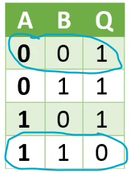
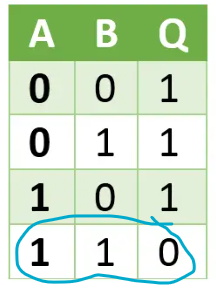
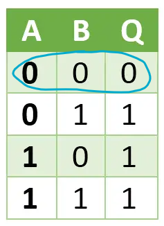
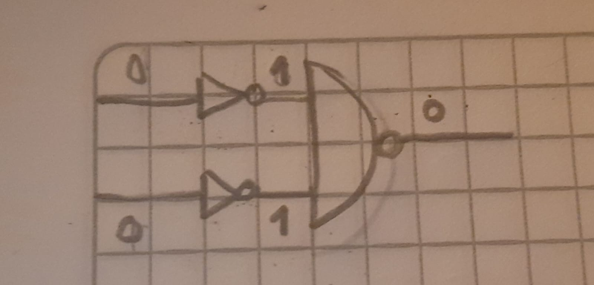
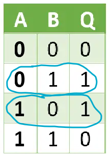
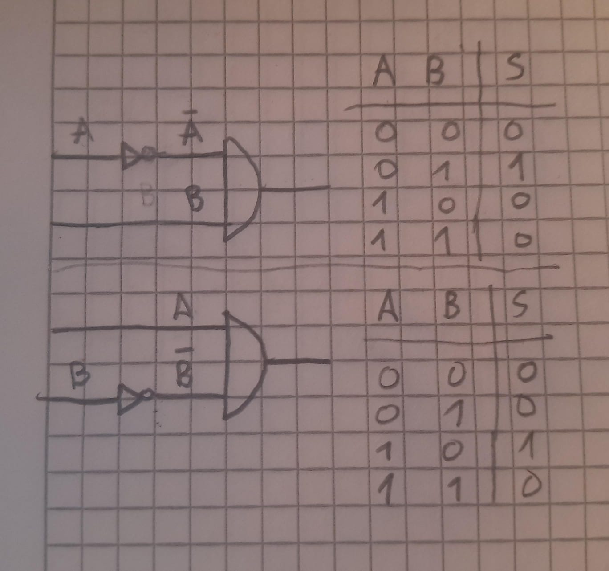
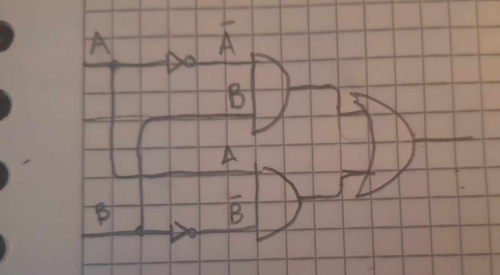
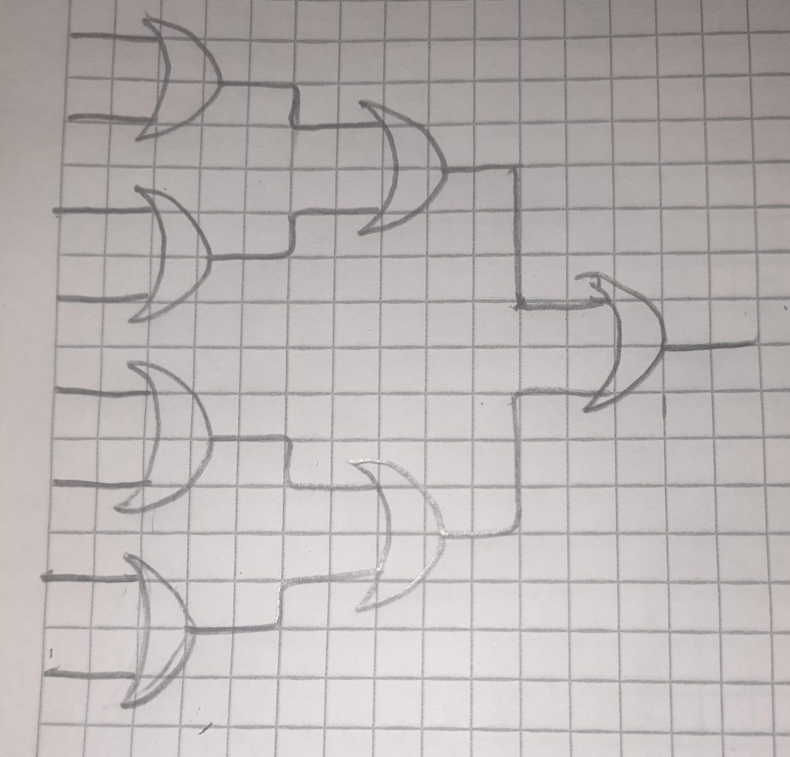

Para realizar la práctica de Lógica Booleana se partió de la puerta NAND
el cual el proyecto ya nos daba.

NOT

Para realizar la puerta NOT se tuvo en cuenta la tabla de verdad de
NAND:

{width="2.25in" height="3.03125in"}

En donde se tuvo en cuenta dos casos:

-   Las entradas son 0 0 y su salida es 1.

-   Las entradas son 1 1 y su salida es 0.

Ya que las entradas son iguales y la salida es contraria. Entonces si
las entradas son la misma, su salida será contraria, cumpliendo con la
labor de la puerta NOT.

Por lo tanto, se utilizó una NAND donde sus dos entradas son la misma
(la entrada única que tendría la NOT).

CHIP Not {

IN in;

OUT out;

PARTS:

Nand(a=in, b=in, out=out);

}

AND:

Para realizar la puerta AND, lo único que se hizo fue utilizar una
puerta NAND y posteriormente se pasó la salida por una NOT. De esta
forma la salida de NAND se invierte, cumpliendo la función del AND.

CHIP And {

IN a, b;

OUT out;

PARTS:

Nand(a=a, b=b, out=nandOut);

Not(in=nandOut, out=out);

}

OR:

Si retomamos la tabla de verdad de NAND, podemos observar que el único
caso en el que la salida es 0, es cuando ambas entradas son 1:

{width="2.25in" height="3.03125in"}

Ahora si observamos la tabla de verdad de OR, podemos observar que el
único caso en el que la salida es 0, es cuando ambas entradas son 0:

{width="2.46875in" height="3.3958333333333335in"}

Entonces, si invertimos las dos entradas del NAND, se obtendría la
función del OR:

{width="5.016479658792651in"
height="2.4082436570428696in"}

Con esto, cuando ambas entradas son 0, la salida será 0. Cualquier otra
opción dará como salida 1.

CHIP Or {

IN a, b;

OUT out;

PARTS:

Not(in=a, out=notA);

Not(in=b, out=notB);

Nand(a=notA, b=notB, out=out);

}

XOR:

La tabla de verdad de XOR es:

{width="2.25in" height="3.2291666666666665in"}

Para realizar la puerta XOR, se evaluó lo que pasaba al combinar una AND
con una NOT en una de sus entradas, observando que las tablas de verdad
son:

{width="5.142305336832896in"
height="4.817708880139983in"}

Si comparamos la tabla de verdad de la puerta XOR con estas tablas de
verdad, se puede observar que si combinamos dichos circuitos (juntarlos
con una OR), obtendremos la tabla de verdad de XOR:

{width="5.088542213473316in"
height="2.8036865704286966in"}

CHIP Xor {

IN a, b;

OUT out;

PARTS:

Not(in=a, out=notA);

Not(in=b, out=notB);

And(a=notA, b=b, out=and1);

And(a=a, b=notB, out=and2);

Or(a=and1, b=and2, out=out);

}

MUX:

Para obtener el multiplexor (MUX) hay que tener en cuenta la dependencia
del resultado hacia el selector (sel). Si el selector es 0, el resultado
será (a), y si el selector es 1, el resultado será (b). Entonces, se
utilizó una puerta NOT para negar el selector.

Posteriormente se utilizaron dos puertas AND, una para (a) y otra para
(b). En el caso de la AND de (a), su segunda entrada fue el selector
negado. Mientras que en la AND de (b), su segunda entrada fue el
selector. Esto se hizo con el propósito de que si el selector es 0,
anulará a (b) pero dejará pasar a (a). Y si el selector es 1, ocurrirá
lo contrario, anulará a (a) pero dejará pasar a (b).

Finalmente, se utilizó una puerta OR para combinar las salidas de las
AND, esto para que la salida sea (a) o (b), según el valor del selector.

CHIP Mux {

IN a, b, sel;

OUT out;

PARTS:

Not(in=sel, out=notSel);

And(a=a, b=notSel, out=andA);

And(a=b, b=sel, out=andB);

Or(a=andA, b=andB, out=out);

}

DMux:

El demultiplexor (DMux), consiste en que si el selector es 0, la salida
(a) será la entrada (in) y la salida (b) será 0. Si el selector es 1, la
salida (b) será la entrada (in) y la salida (a) será 0. Por lo que de
forma similar al multiplexor, se utilizó una puerta NOT para negar el
selector.

Posteriormente se utilizaron dos puertas AND, una para la salida (a) y
otra para la salida (b). Las entradas de la AND de (a) son la entrada
original (in) y el selector negado, de esta forma, en caso del selector
ser 0, el selector negado será 1 y (a) será el valor de entrada (in).
Las entradas de la AND de (b) son la entrada original de (in) y el
selector, de esta forma, en caso del selector ser 1, (b) será el valor
de entrada (in).

CHIP DMux {

IN in, sel;

OUT a, b;

PARTS:

Not(in=sel, out=notSel);

And(a=in, b=notSel, out=a);

And(a=in, b=sel, out=b);

}

Not16:

La puerta Not16 toma una entrada de 16 bits y los niega todos. Para
realizarla se utilizó una puerta NOT para cada uno de los 16 bits para
negarlos.

CHIP Not16 {

IN in\[16\];

OUT out\[16\];

PARTS:

Not(in=in\[0\], out=out\[0\]);

Not(in=in\[1\], out=out\[1\]);

Not(in=in\[2\], out=out\[2\]);

Not(in=in\[3\], out=out\[3\]);

Not(in=in\[4\], out=out\[4\]);

Not(in=in\[5\], out=out\[5\]);

Not(in=in\[6\], out=out\[6\]);

Not(in=in\[7\], out=out\[7\]);

Not(in=in\[8\], out=out\[8\]);

Not(in=in\[9\], out=out\[9\]);

Not(in=in\[10\], out=out\[10\]);

Not(in=in\[11\], out=out\[11\]);

Not(in=in\[12\], out=out\[12\]);

Not(in=in\[13\], out=out\[13\]);

Not(in=in\[14\], out=out\[14\]);

Not(in=in\[15\], out=out\[15\]);

}

And16:

Se utilizó una puerta AND para cada uno de los 16 bits de ambas entradas
para generar la salida de 16 bits.

CHIP And16 {

IN a\[16\], b\[16\];

OUT out\[16\];

PARTS:

And(a=a\[0\], b=b\[0\], out=out\[0\]);

And(a=a\[1\], b=b\[1\], out=out\[1\]);

And(a=a\[2\], b=b\[2\], out=out\[2\]);

And(a=a\[3\], b=b\[3\], out=out\[3\]);

And(a=a\[4\], b=b\[4\], out=out\[4\]);

And(a=a\[5\], b=b\[5\], out=out\[5\]);

And(a=a\[6\], b=b\[6\], out=out\[6\]);

And(a=a\[7\], b=b\[7\], out=out\[7\]);

And(a=a\[8\], b=b\[8\], out=out\[8\]);

And(a=a\[9\], b=b\[9\], out=out\[9\]);

And(a=a\[10\], b=b\[10\], out=out\[10\]);

And(a=a\[11\], b=b\[11\], out=out\[11\]);

And(a=a\[12\], b=b\[12\], out=out\[12\]);

And(a=a\[13\], b=b\[13\], out=out\[13\]);

And(a=a\[14\], b=b\[14\], out=out\[14\]);

And(a=a\[15\], b=b\[15\], out=out\[15\]);

}

Or16:

Se utilizó una puerta OR para cada uno de los 16 bits de ambas entradas
para generar la salida de 16 bits.

CHIP Or16 {

IN a\[16\], b\[16\];

OUT out\[16\];

PARTS:

Or(a=a\[0\], b=b\[0\], out=out\[0\]);

Or(a=a\[1\], b=b\[1\], out=out\[1\]);

Or(a=a\[2\], b=b\[2\], out=out\[2\]);

Or(a=a\[3\], b=b\[3\], out=out\[3\]);

Or(a=a\[4\], b=b\[4\], out=out\[4\]);

Or(a=a\[5\], b=b\[5\], out=out\[5\]);

Or(a=a\[6\], b=b\[6\], out=out\[6\]);

Or(a=a\[7\], b=b\[7\], out=out\[7\]);

Or(a=a\[8\], b=b\[8\], out=out\[8\]);

Or(a=a\[9\], b=b\[9\], out=out\[9\]);

Or(a=a\[10\], b=b\[10\], out=out\[10\]);

Or(a=a\[11\], b=b\[11\], out=out\[11\]);

Or(a=a\[12\], b=b\[12\], out=out\[12\]);

Or(a=a\[13\], b=b\[13\], out=out\[13\]);

Or(a=a\[14\], b=b\[14\], out=out\[14\]);

Or(a=a\[15\], b=b\[15\], out=out\[15\]);

}

Mux16:

Esta puerta consiste en un multiplexor pero que ahora sus entradas y
salida tienen 16 bits. Si el valor del selector es 0, la salida será
(a). Si el valor del selector es 1, la salida será (b).

Se tuvo que utilizar un multiplexor normal (MUX) para cada uno de los 16
bits.

CHIP Mux16 {

IN a\[16\], b\[16\], sel;

OUT out\[16\];

PARTS:

Mux(a=a\[0\], b=b\[0\], sel=sel, out=out\[0\]);

Mux(a=a\[1\], b=b\[1\], sel=sel, out=out\[1\]);

Mux(a=a\[2\], b=b\[2\], sel=sel, out=out\[2\]);

Mux(a=a\[3\], b=b\[3\], sel=sel, out=out\[3\]);

Mux(a=a\[4\], b=b\[4\], sel=sel, out=out\[4\]);

Mux(a=a\[5\], b=b\[5\], sel=sel, out=out\[5\]);

Mux(a=a\[6\], b=b\[6\], sel=sel, out=out\[6\]);

Mux(a=a\[7\], b=b\[7\], sel=sel, out=out\[7\]);

Mux(a=a\[8\], b=b\[8\], sel=sel, out=out\[8\]);

Mux(a=a\[9\], b=b\[9\], sel=sel, out=out\[9\]);

Mux(a=a\[10\], b=b\[10\], sel=sel, out=out\[10\]);

Mux(a=a\[11\], b=b\[11\], sel=sel, out=out\[11\]);

Mux(a=a\[12\], b=b\[12\], sel=sel, out=out\[12\]);

Mux(a=a\[13\], b=b\[13\], sel=sel, out=out\[13\]);

Mux(a=a\[14\], b=b\[14\], sel=sel, out=out\[14\]);

Mux(a=a\[15\], b=b\[15\], sel=sel, out=out\[15\]);

}

Or8Way:

Consiste en operar con OR a 8 bits de entrada (in\[0\] OR in\[1\] OR
in\[2\] OR ... OR in\[7\]).

Para esto, se fue utilizando puertas OR para las entradas, y las salidas
de dichas puertas se ingresaron a otras puertas OR y así sucesivamente
hasta obtener una única salida:

{width="4.828125546806649in"
height="4.6182064741907265in"}

CHIP Or8Way {

IN in\[8\];

OUT out;

PARTS:

Or(a=in\[0\], b=in\[1\], out=or1);

Or(a=in\[2\], b=in\[3\], out=or2);

Or(a=in\[4\], b=in\[5\], out=or3);

Or(a=in\[6\], b=in\[7\], out=or4);

Or(a=or1, b=or2, out=or5);

Or(a=or3, b=or4, out=or6);

Or(a=or5, b=or6, out=out);

}

Mux4Way16:

Consiste en un multiplexor 4 entradas, cada una de 16 bits, y un
selector de 2 bits el cuál según su valor será la salida:

-   sel=00, salida=a

-   sel=01, salida=b

-   sel=10, salida=c

-   sel=11, salida=d

Para obtenerlo se utilizó el multiplexor de 2 entradas de 16 bits
(Mux16). También hay que tener en cuenta que sel\[0\] hace referencia al
bit menos significativo del selector y sel\[1\] hace referencia al bit
más significativo.

Se utilizó el Mux16 para (a) y (b). Si el selector termina en 0, se
obtiene (a). Y si el selector termina en 1, se obtiene (b).

También se utilizó el Mux16 para (c) y (d). Si el selector termina en 0,
se obtiene (c). Y si el selector termina en 1, se obtiene (d).

Finalmente, se utilizó un Mux16 para las salidas de los Mux16
anteriores. Si el selector empieza en 0, se obtiene la salida del Mux16
de (a) y (b). Y si el selector empieza en 1, se obtiene la salida del
Mux16 de (c) y (d).

CHIP Mux4Way16 {

IN a\[16\], b\[16\], c\[16\], d\[16\], sel\[2\];

OUT out\[16\];

PARTS:

Mux16(a=a, b=b, sel=sel\[0\], out=muxAB);

Mux16(a=c, b=d, sel=sel\[0\], out=muxCD);

Mux16(a=muxAB, b=muxCD, sel=sel\[1\], out=out);

}

Mux8Way16:

Consiste en un multiplexor 8 entradas, cada una de 16 bits, y un
selector de 3 bits el cuál según su valor será la salida:

-   sel=000, salida=a

-   sel=001, salida=b

-   sel=010, salida=c

-   sel=011, salida=d

-   sel=100, salida=e

-   sel=101, salida=f

-   sel=110, salida=g

-   sel=111, salida=h

Para obtenerlo se utilizó el multiplexor de 2 entradas de 16 bits
(Mux16). También hay que tener en cuenta que sel\[0\] hace referencia al
bit menos significativo del selector y sel\[2\] hace referencia al bit
más significativo.

Se realizó un procedimiento similar al del multiplexor de 4 entradas al
tener un patrón similar. A continuación se presentan tablas que ilustran
la forma en la que se agruparon las entradas:

Agrupación según el último bit del selector:

  -----------------------------------------------------------------------
  **sel \[2\]**   **sel \[1\]**   **sel \[0\]**   **SALIDA**
  --------------- --------------- --------------- -----------------------
  0               0               0               **A, B**

  0               0               1               

  0               1               0               **C, D**

  0               1               1               

  1               0               0               **E, F**

  1               0               1               

  1               1               0               **G, H**

  1               1               1               
  -----------------------------------------------------------------------

Agrupación según el segundo bit del selector:

  -----------------------------------------------------------------------
  **sel \[2\]**   **sel \[1\]**   **sel \[0\]**   **SALIDA**
  --------------- --------------- --------------- -----------------------
  0               0               0               **A, B, C, D**

  0               0               1               

  0               1               0               

  0               1               1               

  1               0               0               **E, F, G, H**

  1               0               1               

  1               1               0               

  1               1               1               
  -----------------------------------------------------------------------

Agrupación según el primer bit del selector:

+---------------+---------------+---------------+-----------------------+
| **sel \[2\]** | **sel \[1\]** | **sel \[0\]** | **SALIDA**            |
+===============+===============+===============+=======================+
| 0             | 0             | 0             | **A, B, C, D,**       |
|               |               |               |                       |
|               |               |               | **E, F, G, H**        |
|               |               |               |                       |
|               |               |               | **(out)**             |
+---------------+---------------+---------------+-----------------------+
| 0             | 0             | 1             |                       |
+---------------+---------------+---------------+-----------------------+
| 0             | 1             | 0             |                       |
+---------------+---------------+---------------+-----------------------+
| 0             | 1             | 1             |                       |
+---------------+---------------+---------------+-----------------------+
| 1             | 0             | 0             |                       |
+---------------+---------------+---------------+-----------------------+
| 1             | 0             | 1             |                       |
+---------------+---------------+---------------+-----------------------+
| 1             | 1             | 0             |                       |
+---------------+---------------+---------------+-----------------------+
| 1             | 1             | 1             |                       |
+---------------+---------------+---------------+-----------------------+

CHIP Mux8Way16 {

IN a\[16\], b\[16\], c\[16\], d\[16\],

e\[16\], f\[16\], g\[16\], h\[16\],

sel\[3\];

OUT out\[16\];

PARTS:

Mux16(a=a, b=b, sel=sel\[0\], out=muxAB);

Mux16(a=c, b=d, sel=sel\[0\], out=muxCD);

Mux16(a=e, b=f, sel=sel\[0\], out=muxEF);

Mux16(a=g, b=h, sel=sel\[0\], out=muxGH);

Mux16(a=muxAB, b=muxCD, sel=sel\[1\], out=muxABCD);

Mux16(a=muxEF, b=muxGH, sel=sel\[1\], out=muxEFGH);

Mux16(a=muxABCD, b=muxEFGH, sel=sel\[2\], out= out);

}

DMux4Way:

Consiste de un demultiplexor de 1 entrada y 4 salidas. Por lo que el
selector es de 2 bits y dependiendo de su valor se define a donde se
dirige el valor de la entrada:

-   sel=00, salida: a=in, b=0, c=0, d=0

-   sel=01, salida: a=0, b=in, c=0, d=0

-   sel=10, salida: a=0, b=0, c=in, d=0

-   sel=11, salida: a=0, b=0, c=0, d=in

Para obtenerlo se utilizó el procedimiento inverso al del multiplexor de
4 entradas (Mux4Way16). Se recorrió el selector de bit más significativo
al menos significativo separando las salidas:

Se utilizó un DMux para determinar si el valor de la entrada debe ir
para (a)/(b), o para (c)/(d). Si el selector empieza en 0, la entrada se
dirige a (a)/(b). Y si el selector empieza en 1, la entrada se dirige a
(c)/(d).

Finalmente, se utilizaron otros dos DMux para las salidas del DMux
anterior. Si el selector termina en 0,la entrada se irá para (a) o (c)
dependiendo de a donde se dirigió la entrada en el selector anterior. Y
si el selector empieza en 1, la entrada se irá para (b) o (d)
dependiendo de a donde se dirigió la entrada en el selector anterior.

CHIP DMux4Way {

IN in, sel\[2\];

OUT a, b, c, d;

PARTS:

DMux(in=in, sel=sel\[1\], a=outAB, b=outCD);

DMux(in=outAB, sel=sel\[0\], a=a, b=b);

DMux(in=outCD, sel=sel\[0\], a=c, b=d);

}

DMux8Way:

Consiste en un demultiplexor de 1 entrada y 8 salidas, además de un
selector de 3 bits según el cual se decide a cual salida se dirige el
valor de la entrada:

-   sel=000, salida: a=in, b=0, c=0, d=0, e=0, f=0, g=0, h=0

-   sel=001, salida: a=0, b=in, c=0, d=0, e=0, f=0, g=0, h=0

-   sel=010, salida: a=0, b=0, c=in, d=0, e=0, f=0, g=0, h=0

-   sel=011, salida: a=0, b=0, c=0, d=in, e=0, f=0, g=0, h=0

-   sel=100, salida: a=0, b=0, c=0, d=0, e=in, f=0, g=0, h=0

-   sel=101, salida: a=0, b=0, c=0, d=0, e=0, f=in, g=0, h=0

-   sel=110, salida: a=0, b=0, c=0, d=0, e=0, f=0, g=in, h=0

-   sel=111, salida: a=0, b=0, c=0, d=0, e=0, f=0, g=0, h=in

Para obtenerlo se utilizó el demultiplexor de 2 salidas (DMux). También
hay que tener en cuenta que sel\[0\] hace referencia al bit menos
significativo del selector y sel\[2\] hace referencia al bit más
significativo.

Se realizó un procedimiento similar al del demultiplexor de 4 salidas al
tener un patrón similar. A continuación se presentan tablas que ilustran
la forma en la que se agruparon las salidas:

Agrupación en el primer bit del selector:

  -----------------------------------------------------------------------
  **sel \[2\]**   **sel \[1\]**   **sel \[0\]**   **SALIDA**
  --------------- --------------- --------------- -----------------------
  0               0               0               **A, B, C, D**

  0               0               1               

  0               1               0               

  0               1               1               

  1               0               0               **E, F, G, H**

  1               0               1               

  1               1               0               

  1               1               1               
  -----------------------------------------------------------------------

Agrupación en el segundo bit del selector:

  -----------------------------------------------------------------------
  **sel \[2\]**   **sel \[1\]**   **sel \[0\]**   **SALIDA**
  --------------- --------------- --------------- -----------------------
  0               0               0               **A, B**

  0               0               1               

  0               1               0               **C, D**

  0               1               1               

  1               0               0               **E, F**

  1               0               1               

  1               1               0               **G, H**

  1               1               1               
  -----------------------------------------------------------------------

Agrupación en el último bit del selector:

  -----------------------------------------------------------------------
  **sel \[2\]**   **sel \[1\]**   **sel \[0\]**   **SALIDA**
  --------------- --------------- --------------- -----------------------
  0               0               0               **A**

  0               0               1               **B**

  0               1               0               **C**

  0               1               1               **D**

  1               0               0               **E**

  1               0               1               **F**

  1               1               0               **G**

  1               1               1               **H**
  -----------------------------------------------------------------------

CHIP DMux8Way {

IN in, sel\[3\];

OUT a, b, c, d, e, f, g, h;

PARTS:

DMux(in=in, sel=sel\[2\], a=outABCD, b=outEFGH);

DMux(in=outABCD, sel=sel\[1\], a=outAB, b=outCD);

DMux(in=outEFGH, sel=sel\[1\], a=outEF, b=outGH);

DMux(in=outAB, sel=sel\[0\], a=a, b=b);

DMux(in=outCD, sel=sel\[0\], a=c, b=d);

DMux(in=outEF, sel=sel\[0\], a=e, b=f);

DMux(in=outGH, sel=sel\[0\], a=g, b=h);

}
